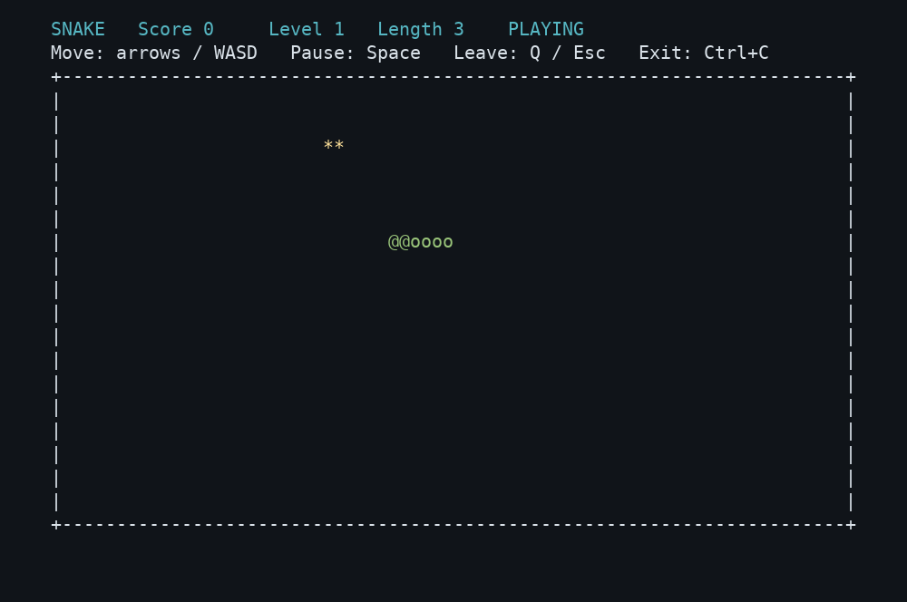
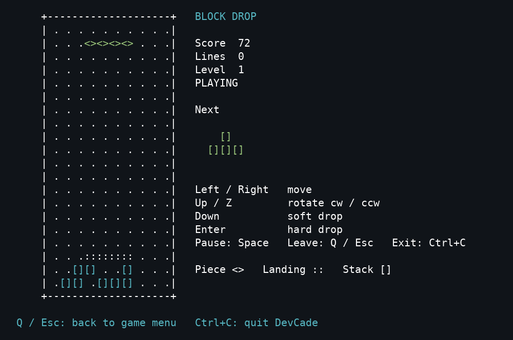
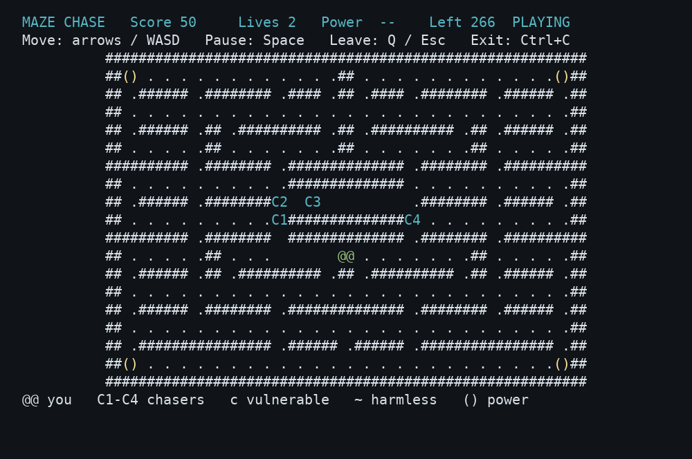
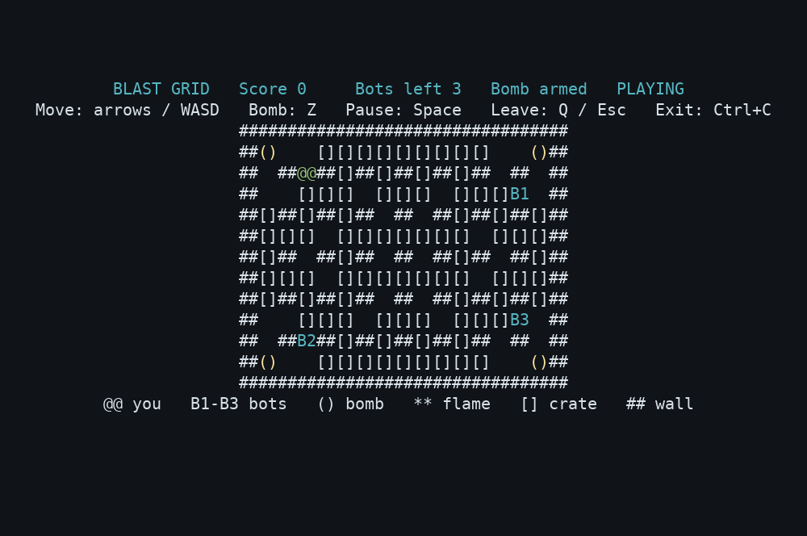
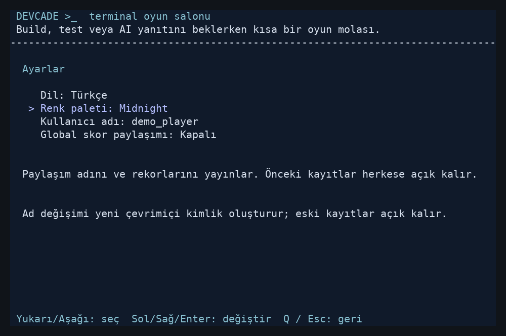

# DevCade

Arcade games that run in your terminal, for the minutes spent waiting on a
build, a test run or an AI response.

DevCade is a non-commercial terminal arcade collection for developers. Open
another terminal, run `devcade`, pick a game and play without leaving the
terminal: no browser, no graphical window, and no language runtime needed for
the distributed binaries. It runs on Windows, macOS and Linux.

<table>
  <tr>
    <td><strong>Snake</strong><br></td>
    <td><strong>Block Drop</strong><br></td>
  </tr>
  <tr>
    <td><strong>Maze Chase</strong><br></td>
    <td><strong>Blast Grid</strong><br></td>
  </tr>
</table>

Captured from the running Linux binary through an 80×24 pseudo-terminal;
using the Colorful palette; these are actual game frames, not mockups. See [capture details](docs/screenshots/README.md).

[Release downloads](https://github.com/cagridursun/devcade/releases) ·
[Installation](docs/install.md) · [Game rules](docs/games.md) · [Settings](docs/settings.md)

## Install and play

**No Go installation, source checkout or build needed.** The package manager
installs the ready-to-play binary and makes `devcade` available in your terminal.

### macOS and Linux — Homebrew

```sh
brew install cagridursun/devcade/devcade
devcade
```

### Windows — Scoop

Add the DevCade bucket once, then install and play:

```powershell
scoop bucket add devcade https://github.com/cagridursun/scoop-devcade
scoop install devcade
devcade
```

Requires [Homebrew](https://brew.sh) or [Scoop](https://scoop.sh) and an
interactive terminal of at least **80 × 24**. The current version is
**1.0.0-rc.1**. [Installation guide](docs/install.md) covers package-manager
setup, updates, uninstalling, direct downloads, installers and optional
source builds.

## Status: v1 release candidate

**All four v1 games are playable.** Running `devcade` opens the arcade menu:

| ID | Game | What you do |
| --- | --- | --- |
| `snake` | Snake | Steer a growing snake to food without hitting walls or yourself |
| `blockdrop` | Block Drop | Rotate and drop falling pieces; clear full rows |
| `mazechase` | Maze Chase | Clear the maze of pellets, dodge four chasers, power up to eat them |
| `blastgrid` | Blast Grid | Bomb crates and outlast three bots in a fixed arena |

Exact rules, scoring and timing for each game are in [docs/games.md](docs/games.md).
The menu also offers the **terminal diagnostic** (`D`, or `devcade --diagnostic`):
a developer tool in which an `@` moves around a box to check input, timing,
resize and terminal restoration.

| Area | Status |
| --- | --- |
| Code: four games, menu, CLI, terminal core | Merged into main, with automated tests (see [CI](.github/workflows/ci.yml)) |
| Release tooling (M7) | Ready: reproducible archives, `SHA256SUMS`, installer scripts, Homebrew formula and Scoop manifest generators ([docs/releasing.md](docs/releasing.md)) |
| Distribution | Public [v1.0.0-rc.1](https://github.com/cagridursun/devcade/releases/tag/v1.0.0-rc.1) via Homebrew (macOS/Linux) and Scoop (Windows); see [installation](docs/install.md) |
| Settings and player profile | Five UI languages, three palettes, persistent personal bests; see [settings](docs/settings.md) |
| Global leaderboard | Live at `https://devcade.cinesdigital.com`; Windows score submission and server restart persistence verified ([service](docs/leaderboard.md)) |
| Real-terminal acceptance | **Partial.** See the [terminal checklist](docs/terminal-checklist.md) |
| License | MIT; dependency notices included in binary archives |

## Settings and scores



Select a game, then **New game** or **Leaderboard**. First launch asks for an
unverified username; Esc continues as guest. **Settings** (or O in the main
menu) changes English (default), Turkish, Spanish, Dutch or French, and
Black / white (default), Midnight or Colorful. Preferences and completed-run
personal bests survive restarts. Global sharing defaults to Off; it publishes
your alias and bests when enabled. Source builds and official release packages
use `https://devcade.cinesdigital.com` by default; local play works offline.
The creator profile opens from the main menu. New games are coming soon.
See [player settings](docs/settings.md) and [global leaderboard deployment](docs/leaderboard.md).

## Controls

Letters work in upper or lower case. Keys act immediately; you never need to
hold a key or press Enter to send it.

| Screen | Keys |
| --- | --- |
| Menu | `Up`/`Down` or `W`/`S` select (wraps), `Enter` open, `O` Settings, `D` terminal diagnostic, `Q`/`Esc`/`Ctrl+C` quit |
| Game submenu | `Up`/`Down` select New game or Leaderboard, `Enter` confirm, `Q`/`Esc` main menu |
| Settings | `Up`/`Down` select, `Left`/`Right`/`Enter` change, `Q`/`Esc` back |
| Leaderboard | `R` refresh, `Up`/`Down` scroll, `Q`/`Esc` game submenu |
| Every game | `Space` pause/resume, `Enter` play again after game over or a win, `Q`/`Esc` back to the game submenu, `Ctrl+C` quit DevCade |
| Snake | arrows/WASD turn (up to two quick turns are queued) |
| Block Drop | `Left`/`Right` (`A`/`D`) move, `Up` (`W`) rotate clockwise, `Z` rotate counterclockwise, `Down` (`S`) soft drop, `Enter` hard drop |
| Maze Chase | arrows/WASD steer; a turn waits until the passage opens |
| Blast Grid | arrows/WASD move one cell, `Z` place a bomb |
| Terminal diagnostic | arrows/WASD change direction, `Space` pause |

`devcade <game>` opens the same submenu. Only the direct diagnostic
(`devcade --diagnostic`) quits on Q/Esc without revealing a menu.

## Behavior shared by every screen

- **One terminal session.** Moving between the menu and a game never
  restarts the screen; it is restored once, when DevCade exits.
- **Fresh runs.** Each launch, and each Enter on an end screen, starts a new
  unpaused run. Leaving discards an unfinished run. Completed runs record a
  personal best per game locally, and optionally sync to the global service.
- **Pause** freezes the game under a `PAUSED` banner. On a game over or win
  screen Space does nothing, so Enter always restarts.
- **Resize.** Boards have a fixed size, so a larger window only re-centers
  them. Below 80×24 a game freezes (it isn't reset) and a warning shows the
  required and current sizes; `Q`, `Esc` and `Ctrl+C` still work. A pause you
  started stays on across resizes.
- **No time catch-up.** Time spent paused, too small, in the menu or on an
  end screen is never replayed into a game, and a stall such as a laptop
  sleep advances a game by at most 100 ms.
- **Exit.** Quitting, Ctrl+C, SIGINT and SIGTERM (console close/logoff/shutdown
  on Windows), a terminal input error, and a crash inside a game all restore
  the original screen, cursor and input mode before any message is printed.
  Exit status: 0 for a normal quit, 1 for an error, 2 for a usage error, 130
  for SIGINT, 143 for SIGTERM.
- `devcade` refuses to start when stdin or stdout is redirected.
- On Windows, `devcade` first checks that the console can process VT escape
  sequences (briefly enabling the flag on `CONOUT$`, then restoring the
  original mode). Consoles that can't (older than Windows 10 1809) get a clear
  error naming Windows Terminal or a newer Windows.
- Restoration cannot be guaranteed if the process is force-killed (SIGKILL,
  Task Manager "End task"), the machine loses power, or the terminal window is
  destroyed abruptly. If a terminal is ever left in a bad state, run `reset`
  (macOS/Linux) or open a new tab.

## Architecture

```
cmd/devcade/              CLI: commands, flags, signals, exit codes, error reporting
internal/arcade/          Catalog, menus, settings, profile and async score coordination
internal/ui/              Localization catalog and localized canvas
internal/profile/         Atomic preferences and personal-best storage
internal/leaderboard/     Optional HTTP API/client, authenticated bests and persisted server
cmd/devcade-leaderboard/  Standalone community leaderboard server
internal/engine/          Game, Canvas, Finisher and key contracts; pause, resize and timing policy
internal/terminal/        tcell adapter: screen lifecycle, event reader, key mapping, canvas
internal/games/snake/     Snake
internal/games/blockdrop/ Block Drop
internal/games/mazechase/ Maze Chase
internal/games/blastgrid/ Blast Grid
internal/games/probe/     The terminal diagnostic, written as a game
tools/release/            Release builder: archives, checksums, Homebrew/Scoop manifests
packaging/                Installer scripts, manifest templates, license notice
docs/                     Game rules, install, releasing, checklist, v1 checkpoint log
```

Dependency direction: `cmd → arcade, terminal → engine ← games`. Games import
only `engine` and the standard library. They never import the terminal
backend or the arcade, read stdin, write stdout, emit escape sequences, handle
signals, start goroutines or touch files or the network.

**Game contract** (`engine.Game`): `MinimumSize`, `Start` (called once, the
first time the screen is big enough; resets the run), `Resize` (layout only),
`HandleInput` (normalized keys), `Update(dt)` (gameplay time, capped at
100 ms and never sent while paused or undersized) and `Render(Canvas)`. Games
draw ASCII board glyphs and localized Latin UI text, two columns per board cell, and never the
last row (the arcade's navigation footer). A game that can end implements
`engine.Finisher` (`Finished() bool`); while it reports true the engine
ignores the pause key, and Enter reaches the game to restart it.

**Input.** The terminal adapter turns each key press into an `engine.Event`:
a normalized `Key` (`Up`, `Down`, `Left`, `Right`, `Pause`, `Select`, `Back`,
`Exit`, `Action`, `Erase`) plus a lower-case ASCII letter, digit or underscore. Space is always
the engine's pause, Enter is `Select`, Z is `Action`, Q/Esc are `Back`
("leave this screen") and Ctrl+C is `Exit` ("leave DevCade"). Games only
receive `Key` values. The menu also reads the letter, which is how `D` opens
the diagnostic even though `d` means "right" in a game.

**Adding a game.** Write a package under `internal/games/<id>` that
implements the contract with a `New() engine.Game` factory, add an entry with
that factory to `arcade.Builtin()`, and give the generic integration test in
`internal/terminal/games_test.go` a recipe that ends a run. The menu,
`devcade list` and `devcade <id>` pick it up from the catalog; the terminal
layer does not change. The catalog validates IDs (unique, lower-case) and
never builds a game except on an actual launch.

**Concurrency.** One loop goroutine owns all navigation, engine and game state
and does all rendering. A reader goroutine forwards backend events through a
64-event buffer; when it is full, backpressure reaches tcell's own bounded
queue, so floods of input cannot grow memory. The reader keeps draining
tcell's queue until `Fini` returns, because tcell's goroutines post with a
blocking send and `Fini` waits for them. Network/browser workers use immutable
profile snapshots and bounded result channels; only the UI loop applies results.
They are cancelled and joined on exit.

**Dependency choice.** [tcell](https://github.com/gdamore/tcell) v2.13.10
handles terminal input, colors, the alternate screen and diff-based rendering
on Windows (VT console APIs) and POSIX terminals (terminfo), all in pure Go.
Each frame redraws tcell's logical buffer; `Show` writes only changed cells,
and a full `Sync` repaint happens only after a resize. `golang.org/x/term` is
used for the interactive-terminal check.

## Compatibility

| Target | Native tests | Cross-build (CGO_ENABLED=0) | Interactive terminal |
| --- | --- | --- | --- |
| Windows amd64 | Local (Windows 11) + CI | Yes | Owner-reported successful gameplay of all four games (2026-10-04); detailed terminal/checklist data not recorded |
| Windows arm64 | — | Yes | Untested |
| macOS arm64 (Apple Silicon) | CI (`macos-latest`) | Yes | Pending |
| macOS amd64 | — | Yes | Untested |
| Linux amd64 | CI (`ubuntu-latest`) | Yes | All four games: PTY startup, gameplay input, normal quit and TTY restoration verified (2026-10-04). Human emulator acceptance pending |
| Linux arm64 | — | Yes | Untested |

Automated tests run every game through the real terminal loop on tcell's
simulated screen. A PTY smoke test is not the same as testing by hand in a
terminal emulator, and a successful cross-build only shows the code compiles
for that target. Git Bash's default mintty window is not a Windows console:
use Windows Terminal, or run `winpty devcade` there.

## Roadmap

| Milestone | Goal | Status |
| --- | --- | --- |
| M0/M1 | Bootstrap and terminal core | Merged; manual compatibility checks tracked |
| M2 | Arcade menu, catalog and built-in selection | Merged |
| M3 | Snake | Merged |
| M4 | Block Drop | Merged |
| M5 | Maze Chase | Merged |
| M6 | Blast Grid | Merged |
| M7 | Packaging, distribution and installers | Public RC with Homebrew/Scoop distribution, six archives, checksums and installers |
| M8 | Four-game v1.0 | Public release candidate; remaining human macOS/Linux acceptance tracked before stable v1.0 |

See [CHANGELOG.md](CHANGELOG.md) and the [v1 checkpoint log](docs/v1-checkpoint.md).
Anonymous community leaderboards are included in this candidate; the shared
HTTPS service is deployed. Verified accounts, multiplayer,
analytics and plugins are out of scope for v1.

## License

MIT — see [LICENSE](LICENSE). DevCade is a free hobby project; MIT permits
commercial use as well. Dependencies retain their own licenses. Binary
archives include the complete MIT license and third-party license texts in
`LICENSE-NOTICE.txt`; see [THIRD_PARTY_NOTICES.txt](THIRD_PARTY_NOTICES.txt).
